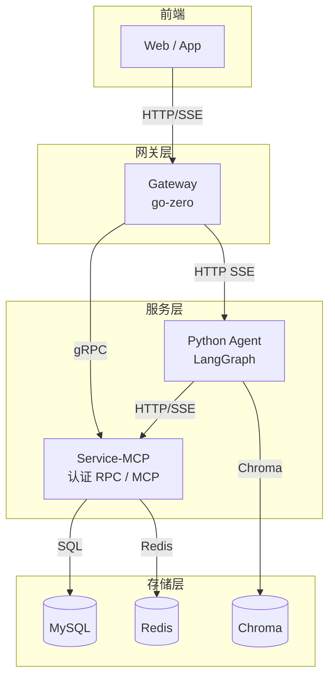

# 企业智能助手

> 基于 LangGraph + go-zero 构建的企业级 AI Agent 系统


## 📖 项目概述

本项目是一个**企业员工自助服务 AI 助手**，采用微服务架构设计，由三个核心组件构成：

| 组件 | 技术栈 | 职责 |
| :--- | :--- | :--- |
| **[Agent](./enterprise_emart_assistant/README.md)** | LangGraph + Fast API SSE | AI 编排层：意图识别、对话管理、工具调用 |
| **[Gateway](./gateway/README.md)** | go-zero + gRPC + HTTP SSE| 流量入口：HTTP 网关、JWT 鉴权、请求路由 |
| **[Service-MCP](./service-mcp/README.md)** | go-zero + gRPC + HTTP | 业务服务层：认证 RPC、MCP 数据服务 |

**系统定位**：为企业员工提供智能化的自助服务，涵盖制度问答、请假报销申请、个人数据查询等场景。

## 🚀 快速开始
- 启动基础设施（MySQL、Redis）
    

- 初始化数据库（创建表结构）
    - mysql -u root -p < deploy/initsql/init.sql

- 启动 Service-MCP（认证 RPC + MCP）
    - cd service-mcp
    - go mod tidy
    - go run main.go

- 启动 Agent
    - cd enterprise_emart_assistant
    - uv sync
    - uv run main.py

- 启动 Gateway
    - cd gateway
    - go mod tidy
    - go run gateway.go

- 访问 http://localhost:8888/view/chat.html 启动聊天界面
    - 账号：admin 密码：admin

## 📂 项目目录结构

```bash
enterprise_emart_assistant/
├── enterprise_emart_assistant/   # Python Agent 服务
│   ├── agents/                   # 子Agent
│   ├── graphs/                   # 状态管理与主图
│   ├── nodes/                    # 图节点实现
│   ├── tools/                    # 工具与 Skill
│   ├── skills/                   # Skill 定义
│   ├── llms/                     # LLM 工厂
│   ├── db/                       # 向量数据库
│   └── README.md
│
├── gateway/                      # 网关服务
│   ├── internal/                 # 内部实现
│   ├── etc/                      # 配置文件
│   └── README.md
│
├── service-mcp/                  # 业务服务层
│   ├── rpc/                      # 认证 RPC
│   ├── internal/                 # 内部实现
│   ├── model/                    # 数据模型
│   ├── etc/                      # 配置文件
│   └── README.md
│
├── protos/                       # Protocol Buffers 定义
│
├── deploy/                       # 部署相关
│
└── README.md                     # 项目根文档
```

## 🏗️ 整体架构图



## 🔭 后续优化规划

- [ ] 增加 docker 部署制作
- [ ] 检查点存储迁移至 PostgreSQL / Redis，支持持久化与分布式部署
- [ ] RAG 检索优化：① 索引增强（元数据+父子块） → ② 混合召回（BM25+向量） → ③ 精排压缩（Rerank+上下文压缩）
