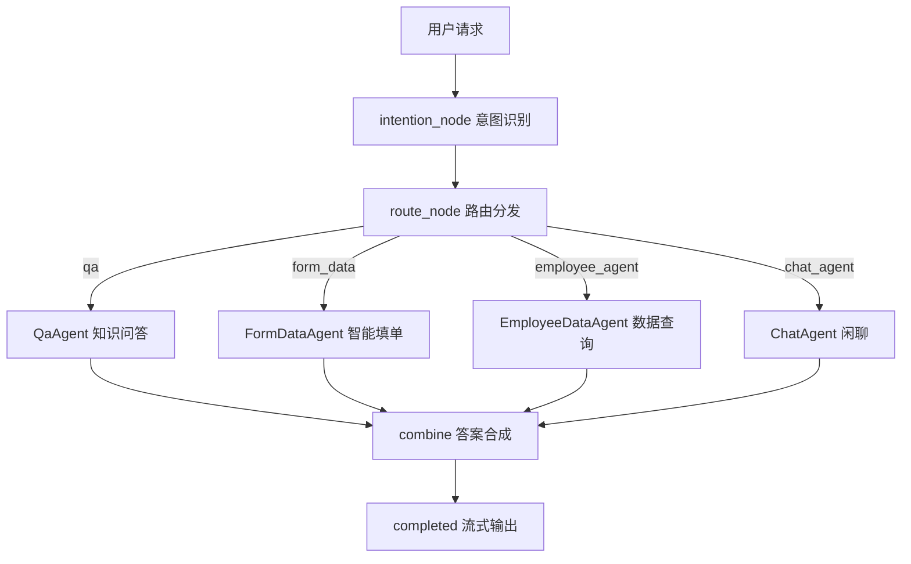

# 🤖 企业智能助手 · AI Agent 服务

> 基于 FastAPI + LangGraph 的多智能体编排服务，是「企业智能助手」的核心 AI 大脑


## 📖 项目概述

本项目是**企业智能助手**的 **AI Agent 服务层**，基于 **FastAPI** 提供 HTTP / SSE 接口，基于 **LangGraph** 构建**多智能体编排**架构。它采用「主图 + 子 Agent」两级编排，理解员工自然语言请求，自动完成**意图识别、路由分发、知识问答、智能填单、数据查询**等任务。

**核心设计理念**：

- **主图负责编排**：意图识别 → 路由分发 → 答案合成 → 流式输出；
- **子 Agent 负责执行**：每个 Agent 是一个独立的 LangGraph 子图，通过 `BaseAgent` 抽象基类统一注册；
- **Skill + Tool 双轨制**：新增业务能力只需扩展 Skill 与 Tool，无需改动核心编排流程。

**定位**：作为整体架构中的核心"大脑"，专注流程编排、状态管理与多智能体协作。


## ✨ 核心特性

| 特性 | 说明 |
| :--- | :--- |
| **🧠 LLM 意图识别** | 主图意图节点通过 LLM 结构化输出自动判断用户意图，并提取关键信息 |
| **🔀 多智能体路由** | 按识别结果动态分发至对应子 Agent（问答 / 填单 / 数据查询 / 闲聊） |
| **📚 RAG 智能问答** | 父子块切分 + 向量检索 + Ollama 重排 + 答案审核重试，检索结果由 LLM 生成最终答案 |
| **📝 智能填单 + AI 决策** | 基于 **Skill + Tool 双轨制**，AI 决策节点自动判断填单状态（完成 / 中断 / 工具调用 / 意图切换），支持**人工确认中断** |
| **🔌 MCP 数据查询** | 通过 `streamable_http` 连接 Go MCP 数据服务，认证拦截器自动注入用户 Token |
| **📡 SSE 流式输出** | 思考过程与最终答案分事件推送，智能分片模拟打字节奏，提升交互体验 |
| **⏳ 断点续跑** | 借助 LangGraph checkpointer + 缓存中断 ID，用户中断后可从任意节点恢复执行 |
| **📥 知识入库** | 支持 `.txt` 批量上传，提供父子块 / 普通两种切块策略，自动写入向量库 |


## 🛠️ 技术栈

| 层级 | 技术选型 |
| :--- | :--- |
| **语言** | Python 3.11+ |
| **Web 框架** | [FastAPI](https://fastapi.tiangolo.com/)（uvicorn，默认端口 8084） |
| **Agent 编排** | [LangGraph](https://langchain-ai.github.io/langgraph/) + [LangChain](https://www.langchain.com/) |
| **LLM** | DeepSeek（默认模型 + opus 模型双档位，工厂模式预留扩展） |
| **向量数据库** | Chroma（本地持久化） |
| **Embedding** | Ollama |
| **重排** | Ollama（Qwen3-Reranker） |
| **MCP 集成** | langchain-mcp-adapters（`streamable_http` 传输） |
| **缓存** | cacheout（本地）/ Redis（可切换） |
| **检查点存储** | `InMemorySaver`（开发阶段，可扩展持久化） |
| **依赖管理** | uv（`pyproject.toml` + `uv.lock`） |


## 🧭 子智能体一览

| Agent | key | 职责 | 关键机制 |
| :--- | :--- | :--- | :--- |
| **QaAgent** | `qa` | 制度 / 知识问答 | RAG 检索 + 答案审核重试 |
| **FormDataAgent** | `form_data` | 请假 / 报销智能填单 | Skill 加载 + AI 决策 + 人工中断 |
| **EmployeeDataAgent** | `employee_agent` | 员工个人数据查询（工资 / 考勤 / 报销） | MCP 工具调用 |
| **ChatAgent** | `chat_agent` | 无特定意图时的开放闲聊 | 历史上下文感知 |


## 📐 架构流程

### 主图流程



### 目录结构

```
enterprise_emart_assistant/
├── main.py                 # FastAPI 应用入口
├── cli.py                  # 命令行交互调试入口
├── app/
│   └── controllers/        # HTTP 路由（chat / rag）
├── core/                   # 启动引导、上下文中间件
├── graphs/                 # 主图与状态定义
├── agents/                 # 子智能体（qa / form / employee / chat）
├── nodes/                  # 主图节点（意图识别 / 路由 / 答案合成）
├── llms/                   # LLM 工厂
├── db/
│   ├── vector.py           # Chroma 向量库
│   ├── rerank/             # Ollama 重排器
│   └── caches/             # 本地 / Redis 缓存
├── tools/                  # 工具容器与业务工具
├── services/               # 对话流式、知识入库、RAG 检索
├── skills/                 # SKILL.md（表单 / 知识）
├── prompts/                # 提示词模板
├── enums/                  # 意图、角色枚举
├── pydantics/              # Pydantic 模型（意图 / 决策 / 响应）
└── tests/                  # 单元测试
```


## 🔌 API 接口

| 方法 | 路径 | 说明 |
| :--- | :--- | :--- |
| **POST** | `/chat` | 对话接口（SSE 流式返回），请求体 `{ question, thread_id? }` |
| **POST** | `/upload_rag_file` | 知识库文件上传（`.txt`，最多 10 个），支持 `parent_child` / `general` 切块策略 |


## 🚀 快速开始

```bash
# 1. 安装依赖
uv sync

# 2. 配置环境变量（参考 .env）
#    DEEPSEEK_API_KEY、EMBEDDING_MODEL、MCP_ADDR 等

# 3. 启动服务（默认端口 8084）
uvicorn main:app --host 0.0.0.0 --port 8084 --reload

# 4. 或使用命令行调试
python cli.py
```


## 🔭 后续规划

- [ ] 检查点存储迁移至 PostgreSQL / Redis，支持持久化与分布式部署
- [ ] 支持更多 LLM 提供商（OpenAI、Azure、Claude 等）
- [ ] 集成 Langfuse，实现全链路可观测性（追踪、监控、评估）
- [ ] 扩展 Skill 生态，支持更多表单类型（加班、采购、出差等）
- [ ] 知识入库支持更多文档格式（docx / pdf 等）

---

## 📌 相关服务

- [Gateway 网关服务](../gateway/README.md) —— 基于 go-zero 的流量入口、JWT 鉴权、gRPC 转发
- [Service-MCP 数据服务](../service-mcp/README.md) —— 基于 go-zero 的认证 RPC 与 MCP 数据能力

---

## 📝 License

MIT © 2026 Mr.zhu
