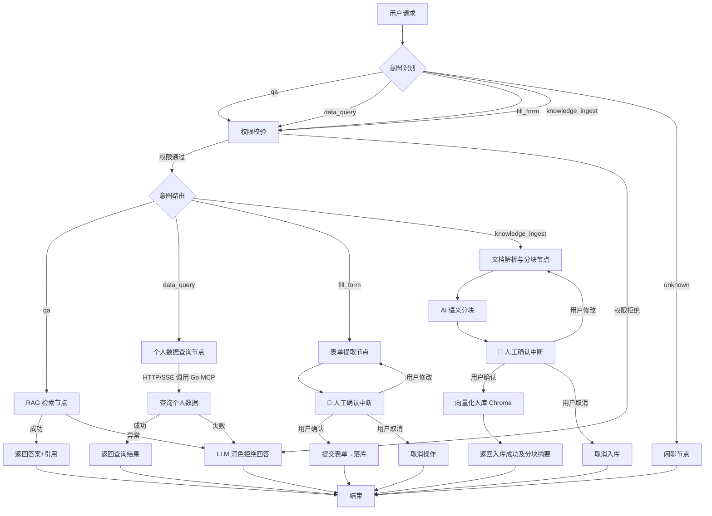

# 🤖 LangGraph Agent Service

> 企业员工自助服务 AI Agent —— 基于 LangGraph 构建的多意图编排系统

---

## 📖 项目概述

本项目是**企业智能助手**的 **Agent 编排层**，基于 **LangGraph** 框架构建。它负责理解员工、主管等角色的自然语言请求，通过**意图识别**、**权限校验**、**工具调用**和**人工中断**等机制，安全、可控地完成制度查询、个人数据检索、事务申请和**文档知识入库**等操作。

**定位**：作为整体架构中的核心"大脑"，上承网关流量，下接数据服务，专注于流程编排与状态管理。

> 项目整体架构（含 Go 网关与 Go MCP 服务）

---

## ✨ 核心特性

| 特性 | 说明 |
| :--- | :--- |
| **🔄 多意图路由** | 基于 LLM 自动判断用户意图（问答/查个人数据/填单/文档入库/闲聊），动态分发至对应处理节点 |
| **🛡️ 双重权限校验** | 网关粗粒度鉴权 + Agent 层细粒度功能级权限（角色→意图白名单） |
| **📚 RAG 智能问答** | 接入向量数据库，实现内部制度文档的语义检索，并**自动溯源引用来源** |
| **📄 文档智能分块与入库** | 支持上传 PDF、DOC、TXT 及纯文本，由 AI 进行语义分块后返回预览，经用户确认后自动向量化存入 Chroma 数据库 |
| **📊 个人数据查询** | 通过 HTTP/SSE 协议调用 Go MCP 数据服务，查询当前用户的薪资、考勤、报销等个人敏感数据，**严格限制仅返回本人信息** |
| **📝 智能填单 + AI 决策** | 基于 **Skill + Tools 双轨制**架构，新增表单类型只需扩展 Skill 与 Tool，无需改动核心流程；配合 **AI 智能决策节点**自动判断填单状态（完成 / 继续），实现高效、可扩展的表单填写体验 |
| **⏳ 断点续跑** | 借助 LangGraph 检查点机制，用户中断操作后可在任意节点恢复，状态不丢失；开发阶段使用内存存储，后续可扩展 SQLite/Redis |
| **💬 自由闲聊** | 无法识别业务意图时，自动进入闲聊模式，AI 以开放域对话方式与用户交互，提升体验 |
| **🔄 异常兜底** | 节点异常或权限拒绝时，由 LLM 对拒绝结果进行自然语言润色后返回，提升用户体验 |

---

## 🛠️ 技术栈

| 层级 | 技术选型 |
| :--- | :--- |
| **语言** | Python 3.11+ |
| **框架** | [LangGraph](https://langchain-ai.github.io/langgraph/)（状态机编排）、[gRPC](https://grpc.io/)（RPC 通信） |
| **LLM** | DeepSeek（当前默认），架构预留扩展接口，可无缝切换至 OpenAI、Azure 等兼容 API |
| **向量数据库** | Chroma（轻量级，本地部署） |
| **MCP 集成** | 通过 **HTTP/SSE** 协议调用 Go MCP 数据服务，支持流式响应与标准 MCP 工具调用 |
| **文档解析** | `pypdf`（PDF 解析）、`python-docx`（DOC 解析）、内置文本处理 |
| **检查点存储** | `MemorySaver`（开发阶段），后续可扩展 `SqliteSaver` / `RedisSaver` |
| **可观测性** | 预留扩展能力，后续集成 Langfuse |

---

## 🧭 支持的意图类型

| 意图 | 说明 | 节点路由 | 所需权限 |
| :--- | :--- | :--- | :--- |
| **`qa`** | 制度/知识问答 | → RAG 检索节点 | employee 及以上 |
| **`data_query`** | 个人数据查询（工资/考勤/报销） | → 个人数据查询节点（调用 Go MCP） | employee 及以上 |
| **`fill_form`** | 智能填单（请假/报销） | → 表单提取 → **人工确认中断** | employee 及以上 |
| **`knowledge_ingest`** | 文档上传与知识入库 | → 文档解析 → AI 分块 → **人工确认中断** → 向量化入库 | employee 及以上 |
| **`unknown`** | 无法识别业务意图 | → 闲聊节点（自由对话） | 全员 |

---

## 📐 架构流程图



### 流程说明

1. **入口**：请求经 Go 网关透传，通过 gRPC metadata 携带 `user-id` 和 `user-role`。
2. **意图识别（B-01）**：LLM 分析用户输入，判定为 `qa` / `data_query` / `fill_form` / `knowledge_ingest` / `unknown`。
3. **功能级权限校验（B-02）**：根据角色校验该意图是否允许执行（`unknown` 跳过校验直接进入闲聊）。
4. **意图路由（条件边）**：按意图类型分发至不同处理节点。
5. **读操作**：RAG 或个人数据查询完成后直接返回。个人数据查询严格限定为当前用户本人信息。
6. **写操作 - 填单（B-06）**：提取表单数据后，通过 `interrupt()` 挂起，等待确认/修改/取消。
7. **写操作 - 文档入库**：解析 PDF/DOC/TXT 提取纯文本，由 LLM 进行语义分块，分块结果通过 `interrupt()` 挂起供用户预览确认，确认后调用 Chroma 向量化存储。
8. **闲聊（`unknown`）**：无法识别业务意图时，AI 以开放域对话方式与用户自由聊天。
9. **断点续跑（B-16）**：所有状态经由 `MemorySaver` 持久化（开发阶段），用户中断后可恢复。
10. **异常/拒绝兜底**：节点异常或权限校验拒绝时，由 LLM 润色为友好回复返回。

---

<!-- ## 📂 项目目录结构

```bash
python-langgraph/
├── graph/
│   ├── __init__.py
│   ├── state.py                # AssistantState 定义
│   ├── graph_builder.py        # 图构建与编译（含检查点）
│   └── nodes/
│       ├── __init__.py
│       ├── b01_router.py       # 意图识别节点
│       ├── b02_permission.py   # 功能级权限校验节点
│       ├── b03_rag.py          # RAG 问答节点
│       ├── b04_data_query.py   # 个人数据查询节点（HTTP/SSE 调用 Go MCP）
│       ├── b05_ingest.py       # 文档解析与分块节点
│       ├── b06_fill_form.py    # 智能填单 + interrupt 确认
│       ├── b16_checkpoint.py   # 检查点配置（当前使用 MemorySaver）
│       ├── b18_fallback.py     # 异常/拒绝兜底节点（LLM 润色返回）
│       └── b00_chat.py         # 闲聊节点（自由对话）
├── mcp_client/                 # MCP HTTP/SSE 客户端封装
│   ├── __init__.py
│   └── client.py               # HTTP/SSE 连接管理与工具调用
├── parser/                     # 文档解析模块
│   ├── __init__.py
│   ├── pdf_parser.py           # PDF 解析（pypdf）
│   ├── doc_parser.py           # DOC 解析（python-docx）
│   └── text_parser.py          # 纯文本与字符串处理
├── chunker/                    # 文档分块模块
│   ├── __init__.py
│   └── semantic_chunker.py     # AI 语义分块（LLM 驱动）
├── vector_store/               # 向量数据库封装
│   ├── __init__.py
│   └── chroma_client.py        # Chroma 初始化与向量化存储
├── proto/
│   └── agent.proto             # gRPC 服务协议定义
├── servicer.py                 # gRPC 服务实现
├── server.py                   # gRPC 服务启动入口
├── requirements.txt
└── README.md                   # 本文件
```

--- -->
<!-- 
## ⚙️ 快速开始

### 环境变量

```bash
# DeepSeek API（当前默认 LLM）
DEEPSEEK_API_KEY=your-deepseek-api-key
DEEPSEEK_BASE_URL=https://api.deepseek.com/v1

# （可选）如需切换其他 LLM，可额外配置
# OPENAI_API_KEY=your-openai-key
# AZURE_OPENAI_ENDPOINT=...

# gRPC metadata 透传字段名（与网关约定一致）
USER_ID_KEY=user-id
USER_ROLE_KEY=user-role

# Go MCP 服务 HTTP/SSE 地址
MCP_SERVICE_URL=http://localhost:8080/mcp

# 向量数据库配置
CHROMA_PERSIST_DIR=./chroma_data
CHROMA_COLLECTION_NAME=company_knowledge

# （可选）Langfuse 后续集成时启用
# LANGFUSE_PUBLIC_KEY=...
# LANGFUSE_SECRET_KEY=...
```

### 安装与运行

```bash
# 1. 安装依赖
pip install -r requirements.txt

# 2. 生成 gRPC 代码（如使用 protobuf）
python -m grpc_tools.protoc -I./proto --python_out=. --grpc_python_out=. ./proto/agent.proto

# 3. 启动 gRPC 服务（默认端口 50051）
python server.py
```

### gRPC 接口定义

| 方法 | 类型 | 说明 |
| :--- | :--- | :--- |
| `ChatStream` | 服务端流式 | 返回 AI 逐字输出，包含中断信号 |
| `Resume` | 一元 | 恢复中断的流程（用户确认/修改后调用） |
| `HealthCheck` | 一元 | 健康检查 |

具体协议定义请参见 `proto/agent.proto` 文件。

--- -->

## 🔧 开发者注意事项

1. **LLM 扩展**：当前默认使用 DeepSeek，如需切换其他 LLM，只需在 `graph_builder.py` 中替换 `ChatModel` 实例化逻辑，其余代码无需改动。
2. **MCP 服务必须提前启动**：确保 `MCP_SERVICE_URL` 指向有效的 Go MCP HTTP 服务，否则 `data_query` 节点会触发兜底。
3. **个人数据查询安全**：本服务仅将用户 ID 透传给 Go MCP 服务，**数据级权限校验由 Go MCP 层强制实施**，Agent 层不接触具体数据。
4. **文档入库流程**：文档解析后需经 LLM 语义分块，分块结果会通过 `interrupt()` 挂起供用户预览确认。用户确认后才执行向量化入库，**用户可在预览阶段取消操作**。
5. **支持的文件格式**：当前支持 PDF（.pdf）、DOC（.doc / .docx）、TXT（.txt）及直接传入的字符串文本。更多格式（如 PPT、Excel）将在后续扩展。
6. **分块策略**：采用 LLM 驱动的语义分块，根据文档语义边界进行智能切分，兼顾上下文完整性与检索精度。
7. **MCP 通信协议**：采用 HTTP/SSE 方式，支持标准的 MCP 工具调用与流式响应。客户端封装位于 `mcp_client/` 目录。
8. **中断恢复机制**：调用方需识别 `interrupt` 信号，展示确认 UI，并将用户选择通过 `Resume` 接口传回。
9. **检查点存储**：当前使用内存存储（`MemorySaver`），服务重启后状态丢失。后续可按需切换为 `SqliteSaver` 或 `RedisSaver`。
10. **闲聊与兜底**：`unknown` 意图走专门的闲聊节点，不触发异常；真正的系统错误或权限拒绝进入兜底节点，由 LLM 润色后返回友好回复。

---

## 🔭 后续规划

- [ ] 支持更多文档格式（PPT、Excel、Markdown 等）
- [ ] 支持更多 LLM 提供商（OpenAI、Azure、Claude 等）
- [ ] 检查点存储迁移至 SQLite / Redis，支持持久化与分布式部署
- [ ] 集成 Langfuse，实现全链路可观测性（追踪、监控、评估）
- [ ] 接入真实 RBAC 系统，替代静态权限白名单
- [ ] 文档分块策略支持用户自定义（固定长度、按段落、语义等）

---

## 📌 相关服务

- [Go 网关服务](../go-gateway/README.md) —— 流量入口、JWT 鉴权、Header 透传
- [Go MCP 数据服务](../go-mcp-server/README.md) —— 个人数据查询（通过 HTTP/SSE 暴露，强制校验用户身份，仅返回本人数据）

---

## 📝 License

MIT © 2026 Mr.zhu