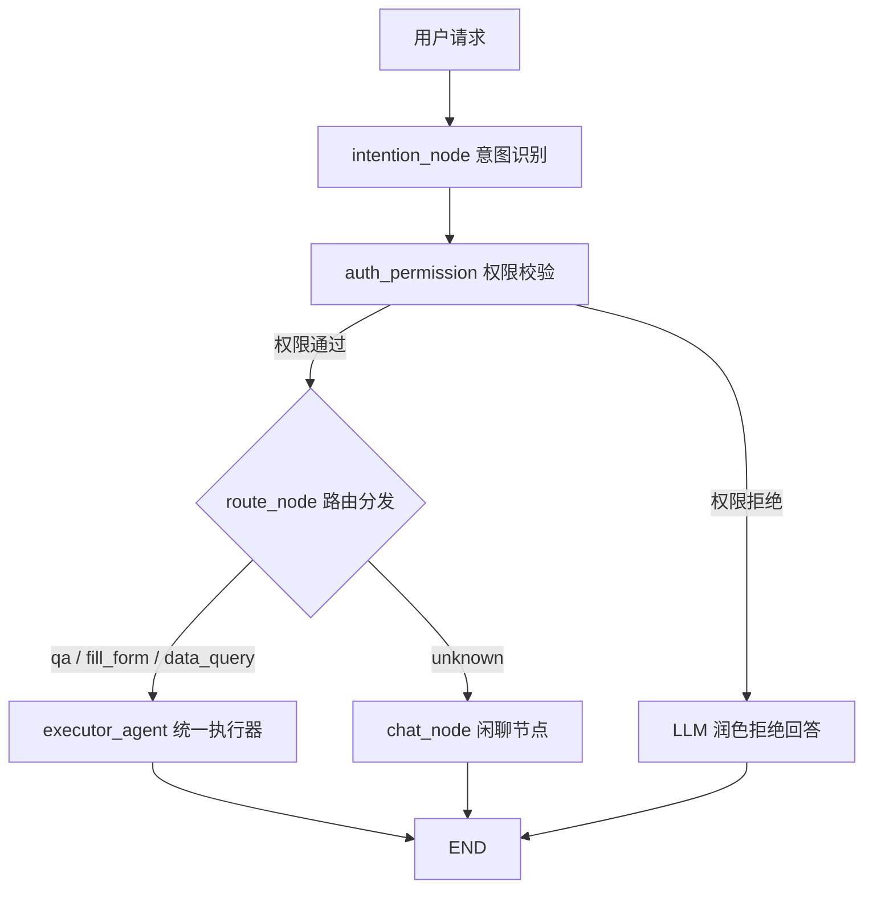

# 🤖 LangGraph Agent Service

> 企业员工自助服务 AI Agent —— 基于 LangGraph 构建的统一执行器架构

## 📖 项目概述

本项目是**企业智能助手**的 **Agent 编排层**，基于 **LangGraph** 框架构建。它负责理解员工、主管等角色的自然语言请求，通过**意图识别**、**权限校验**、**统一执行器**和**人工中断**等机制，安全、可控地完成制度问答和事务申请等操作。

**核心设计理念**：所有业务意图由统一的 `BaseExecutorAgent` 处理，新增功能只需扩展 **Skill + Tool**，无需改动核心流程。

**定位**：作为整体架构中的核心"大脑"，专注于流程编排与状态管理。

> 项目整体架构（含 Go 网关服务）

## ✨ 核心特性

| 特性 | 说明 |
| :--- | :--- |
| **🔄 多意图路由** | 基于 LLM 自动判断用户意图（问答 / 填单 / 闲聊），动态分发至对应处理节点 |
| **🛡️ 双重权限校验** | 网关粗粒度鉴权 + Agent 层细粒度功能级权限（角色→意图白名单） |
| **📚 RAG 智能问答** | 接入向量数据库，实现内部制度文档的语义检索，检索结果由 `completed` 节点调用 LLM 生成最终答案并溯源引用来源。当前为粗筛阶段，后续将引入重排模型进行召回优化 |
| **📝 智能填单 + AI 决策** | 基于 **Skill + Tools 双轨制**架构，新增表单类型只需扩展 Skill 与 Tool，无需改动核心流程；配合 **AI 智能决策节点**自动判断填单状态（完成 / 继续 / 意图切换），实现高效、可扩展的表单填写体验 |
| **⏳ 断点续跑** | 借助 LangGraph 检查点机制，用户中断操作后可在任意节点恢复，状态不丢失；开发阶段使用内存存储，后续可扩展 PostgreSQL/Redis |
| **💬 自由闲聊** | 无法识别业务意图时，自动进入闲聊模式，AI 以开放域对话方式与用户交互，提升体验 |
| **🔄 异常兜底** | 节点异常或权限拒绝时，由 LLM 对拒绝结果进行自然语言润色后返回，提升用户体验 |

## 🛠️ 技术栈

| 层级 | 技术选型 |
| :--- | :--- |
| **语言** | Python 3.11+ |
| **框架** | [LangGraph](https://langchain-ai.github.io/langgraph/)（状态机编排） |
| **LLM** | DeepSeek（当前默认），架构预留扩展接口，可无缝切换至 OpenAI、Azure 等兼容 API |
| **向量数据库** | Chroma（轻量级，本地部署） |
| **MCP 集成** | 预留能力，后续通过 **HTTP/SSE** 协议调用 Go MCP 数据服务 |
| **检查点存储** | `InMemorySaver`（开发阶段），后续可扩展 `PostgreSQLSaver` / `RedisSaver` |
| **可观测性** | 预留扩展能力，后续集成 Langfuse |

## 🧭 支持的意图类型

| 意图 | 说明 | 节点路由 | 所需权限 | 状态 |
| :--- | :--- | :--- | :--- | :--- |
| **`qa`** | 制度 / 知识问答 | → 统一执行器（`qa_query` 工具检索 + `completed` 节点生成答案） | employee 及以上 | ✅ 已完成 |
| **`fill_form`** | 智能填单（请假 / 报销） | → 统一执行器 → Skill 加载 → 工具调用 → **人工确认中断** | employee 及以上 | ✅ 已完成 |
| **`data_query`** | 个人数据查询（工资 / 考勤 / 报销） | → 统一执行器 → 调用 Go MCP 数据服务 | employee 及以上 | 🚧 开发中 |
| **`unknown`** | 无法识别业务意图 | → 闲聊节点（自由对话） | 全员 | ✅ 已完成 |

## 📐 架构流程图

### 主图流程

## 🔭 后续规划

- [ ] RAG 检索优化：引入重排模型（如 BGE-Reranker）进行精排
- [ ] 检查点存储迁移至 PostgreSQL / Redis，支持持久化与分布式部署
- [ ] 支持更多 LLM 提供商（OpenAI、Azure、Claude 等）
- [ ] 集成 Langfuse，实现全链路可观测性（追踪、监控、评估）
- [ ] 扩展 Skill 生态，支持更多表单类型（加班、采购、出差等）
- [ ] 支持多轮对话中的上下文记忆与状态持久化

---

## 📌 相关服务

- [Go 网关服务](../go-gateway/README.md) —— 流量入口、JWT 鉴权、Header 透传
- [Go MCP 数据服务](../go-mcp-server/README.md) —— 个人数据查询（通过 HTTP/SSE 暴露，强制校验用户身份，仅返回本人数据）

---

## 📝 License

MIT © 2026 Mr.zhu