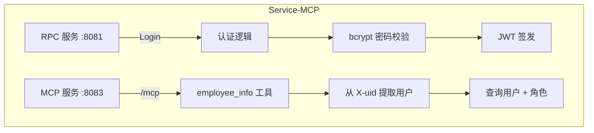

# Service-MCP

> 基于 go-zero 框架构建的后端服务层，提供登录认证 RPC 与 MCP 数据查询能力


## 📖 项目概述

**Service-MCP** 是**企业智能助手**的 **后端服务层**，基于 [go-zero](https://go-zero.dev/) 框架构建。它采用「RPC + MCP」双服务架构，承载两类核心能力：

- **认证 RPC 服务**：账号密码登录验证、JWT Token 签发
- **MCP 数据服务**：员工个人信息查询（通过 `streamable_http` 暴露，供 AI Agent 工具调用）

**定位**：作为整体架构中的业务能力层，承载用户认证与数据访问，不涉及 AI 编排逻辑。


## ✨ 核心特性

| 特性 | 说明 |
| :--- | :--- |
| **🔐 登录认证** | 基于 gRPC 的 `Login` RPC，账号密码校验后签发 JWT（Access / Refresh 双 Token） |
| **🔑 密码安全** | 密码采用 bcrypt 加密存储，校验使用 `CompareHashAndPassword` |
| **🔌 MCP 数据服务** | 基于 `mcp-go` 提供 `streamable_http` 传输，暴露 `employee_info` 工具 |
| **👤 员工信息查询** | 从请求 Header 的 `X-uid` 提取用户身份，查询用户与角色信息 |
| **🗄️ 多角色模型** | 用户-角色多对多关联（`ai_user` / `ai_role` / `ai_user_role`） |


## 🛠️ 技术栈

| 层级 | 技术选型 |
| :--- | :--- |
| **语言** | Go 1.25+ |
| **框架** | go-zero |
| **RPC** | gRPC + protobuf（goctl 生成） |
| **MCP** | `mark3labs/mcp-go`（`streamable_http`） |
| **认证** | `golang-jwt/jwt`（HS256）+ `bcrypt` |
| **ORM** | GORM + MySQL（软删除插件） |


## 📐 架构流程



### 服务端口

| 服务 | 端口 | 说明 |
| :--- | :--- | :--- |
| **RPC 服务** | `8081` | `Login` 登录接口（gRPC） |
| **MCP 服务** | `8083` | `POST /mcp`（`streamable_http`） |


## 🗂️ 目录结构

```
service-mcp/
├── main.go                      # 入口：RPC + MCP 双服务启动
├── etc/main.yaml                # 服务配置（端口 / MySQL / Auth）
├── pb/                          # protobuf 生成代码
├── internal/
│   ├── config/                  # 配置结构体
│   ├── mcp/                     # MCP 服务构建与路由
│   ├── routes/                  # MCP 工具注册
│   ├── server/                  # RPC 服务实现（Login）
│   ├── logic/                   # RPC 业务逻辑
│   ├── middlewares/             # 认证中间件
│   ├── tools/                   # MCP 工具定义（employee_info）
│   ├── services/                # 业务服务层（认证 / 员工）
│   ├── repository/              # 数据访问层（DAO / 模型）
│   ├── svc/                     # 服务上下文
│   └── ...
└── rpc/                         # RPC 客户端封装
```


## 🚀 快速开始

```bash
# 1. 配置 etc/main.yaml（MySQL、Auth、端口等）

# 2. 启动服务
go run main.go -f etc/main.yaml

# 3. RPC 服务监听 :8081，MCP 服务监听 :8083（POST /mcp）
```


## 🔭 后续规划

- [ ] MCP 工具权限校验（`AuthMiddleware` 目前为 TODO 占位）
- [ ] 补充薪资、考勤、报销等更多数据查询工具
- [ ] 支持 Etcd 服务注册发现

---

## 📝 License

MIT © 2026 Mr.zhu
